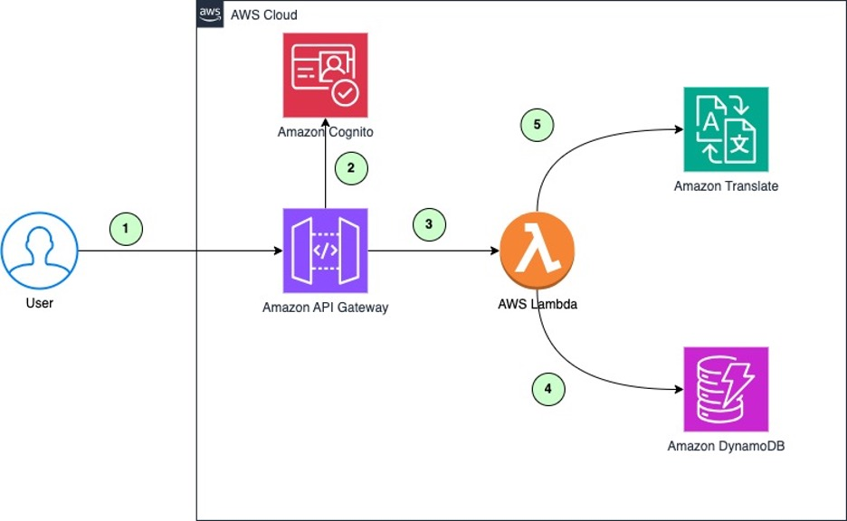

# Amazon Translate Caching Architecture

## Introduction

Amazon Translate is a neural machine translation service that delivers fast, high-quality, affordable, and customizable language translation. When content sets have phrases or sentences that are often repeated, implementing a translation cache can significantly reduce costs by reusing cached translations instead of paying for brand-new translations.

This project demonstrates how to build a caching mechanism for Amazon Translate using AWS services. The solution uses Amazon DynamoDB as the cache layer, Amazon API Gateway as the REST API, and AWS Lambda for the backend logic.

## Architecture

The caching solution uses the following AWS services:

1. **Amazon DynamoDB**: Serves as the cache layer to store translations from Amazon Translate.
2. **Amazon API Gateway**: Provides the REST API for translation requests.
3. **AWS Lambda**: Handles the backend logic, including checking the cache, calling Amazon Translate, and storing translations in DynamoDB.
4. **Amazon Cognito**: Manages user authentication and authorization for the translation REST API.

The high-level architecture is as follows:



1. The user or application makes a request to the translation REST API.
2. Amazon Cognito verifies the identity token in the request to grant access to the translation REST API.
3. The API Gateway invokes the Lambda function, which checks the DynamoDB table for an existing translation.
4. If a match is found, the translation is retrieved from DynamoDB.
5. If no match is found, the content is sent to Amazon Translate to perform the translation. The translated content is then stored in DynamoDB.


## Prerequisites

To deploy the solution, you'll need:

1. An AWS account with the necessary permissions to launch AWS CloudFormation templates and create IAM roles.
2. AWS Cloud Development Kit (AWS CDK) installed and configured on your machine.
3. Postman installed and configured on your computer.

## Deployment

1. Clone the repository from GitHub:

   ```
   git clone https://github.com/aws-samples/maximize-translate-architecture-strategic-caching
   ```

2. Install the required Python dependencies:

   ```
   python3 -m pip install -r requirements.txt
   ```

3. Open the `app.py` file and replace the AWS account number and AWS Region with your own.

4. Verify that the AWS CDK is bootstrapped:

   ```
   cdk bootstrap
   ```

5. Deploy the stack using the AWS CDK:

   ```
   cdk deploy
   ```

This will create the DynamoDB table, Lambda function, and other necessary resources.

## Testing the Caching Setup

Refer to the `Testing the Caching Setup` section in the blog [Maximize Your Amazon Translate Architecture Using Strategic Caching Layers](https://aws.amazon.com/blogs/machine-learning/maximize-your-amazon-translate-architecture-using-strategic-caching-layers/)

## Cleanup

To delete the stack and associated resources, you can use the AWS CDK:

```
cdk destroy
```

Note that the DynamoDB table and CloudWatch logs are not automatically deleted by the stack removal. You can manually delete these resources if needed.

